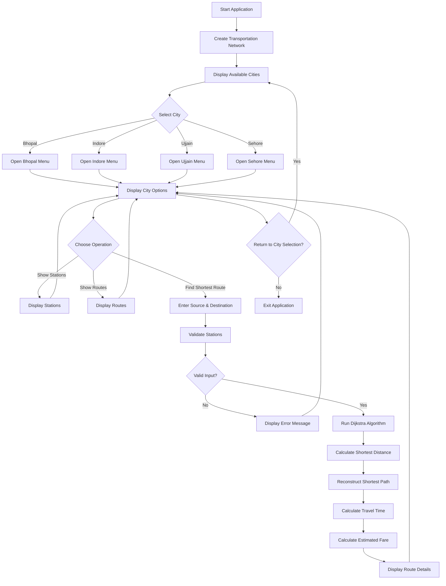

# 🚌 Smart  Route Planner

## 📖 Introduction

Transportation networks contain many stations and routes, making it difficult to manually determine the shortest and most efficient path between two locations.

This project presents a **Java-based SMART Route Planner** that uses graph data structures and **Dijkstra's Shortest Path Algorithm** to find the shortest route between stations.

The system supports four cities:

- Bhopal
- Indore
- Ujjain
- Sehore

The application allows users to:

- Select a city
- View stations of the selected city
- View available routes
- Find the shortest route between two stations
- Calculate total distance
- Estimate travel time
- Calculate estimated fare
- Display transportation details

The main goal of this project is to demonstrate how **Java, Object-Oriented Programming, Data Structures, Graph Theory, and Dijkstra's Algorithm** can be combined to solve a practical route-planning problem.

---

# 🌍 Real-World Problem

Finding an efficient route between different stations can become difficult when a transportation network contains many interconnected stations.

Some common problems include:

- Large number of stations
- Multiple routes between locations
- Different transportation modes
- Difficulty in manually finding the shortest route
- Need for quick route calculation
- Different travel times and fares

### Major Issue

> Difficulty in finding the shortest and most efficient route manually.

An automated route planning system can calculate the best route quickly using graph algorithms.

---

# 🎯 Objectives

The main objectives of this project are:

- Find the shortest route between two stations
- Support multiple cities
- Display stations of the selected city
- Display available routes
- Calculate total route distance
- Estimate travel time
- Calculate estimated fare
- Display transportation details
- Apply Dijkstra's Shortest Path Algorithm
- Demonstrate Object-Oriented Programming concepts
- Implement graph data structures
- Provide a completely command-line based application

---

# 📚 Concepts Used

This project demonstrates several concepts from Java programming and Data Structures coursework.

## Java / OOP Concepts

- Classes and Objects
- Encapsulation
- Inheritance
- Abstraction
- Polymorphism
- Interface
- Abstract Class
- Method Overriding
- Comparable
- Exception Handling

## Data Structures

- Graph
- Adjacency List
- HashMap
- ArrayList
- HashSet
- PriorityQueue

## Algorithms

- Dijkstra's Shortest Path Algorithm

## Other Concepts

- Conditional Statements
- Loops
- Functions / Methods
- User Input using `Scanner`

---

# 🛠️ Tools & Technologies

## Programming Language

- **Java**

## Data Structures

- `HashMap`
- `ArrayList`
- `HashSet`
- `PriorityQueue`

## Java Concepts

- Interface
- Abstract Class
- Inheritance
- Encapsulation
- Polymorphism
- Comparable
- Exception Handling

## Algorithm

- **Dijkstra's Shortest Path Algorithm**

## User Interface

- Console / Command Line Interface

---

# 📌 Problem Definition

Users may have multiple possible routes between stations. Manually finding the shortest route becomes difficult as the number of stations and connections increases.

Different routes may also have:

- Different distances
- Different transportation modes
- Different travel times
- Different fares

Therefore, a route planning system is required to automatically calculate the best route.

This project solves the problem using a **weighted graph and Dijkstra's Shortest Path Algorithm**.

---

# 📋 Requirements Analysis

## Functional Requirements

The system should be able to:

- Select a city
- Display stations of the selected city
- Display routes of the selected city
- Accept starting station
- Accept destination station
- Find the shortest route
- Calculate total distance
- Calculate estimated travel time
- Calculate estimated fare
- Display transport details
- Allow users to return to city selection
- Allow users to exit the application

## Non-Functional Requirements

The system should provide:

- Easy-to-use interface
- Fast execution
- Low memory usage
- Simple command-line interface
- No GUI requirement
- No database requirement
- No external libraries
- Reliable route calculation

---

# 🏗️ Top-Down Design

```text
makeNetwork()        → Creates stations and routes
addStation()         → Adds a station to the network
connect()            → Connects two stations
showCities()         → Displays available cities
showStations()       → Displays stations of selected city
showRoutes()         → Displays routes of selected city
cityMenu()           → Displays city-specific menu
findRoute()          → Takes source and destination
shortestPath()       → Finds shortest route using Dijkstra
belongsToCity()      → Validates station and city
main()               → Runs the complete system
```

---

# 📊 Project Flowchart



---

# 🏗️ System Architecture

The project follows a simple layered structure:

```text
                 Smart Multi-City Route Planner
                              |
                 +------------+------------+
                 |                         |
             User Input               Route Network
                 |                         |
             Scanner                  Graph Structure
                 |                         |
                 +------------+------------+
                              |
                     Route Calculation
                              |
                     Dijkstra Algorithm
                              |
             +----------------+----------------+
             |                |                |
         Distance        Travel Time          Fare
             |                |                |
             +----------------+----------------+
                              |
                       Console Output
```

The system receives user input through the command line, processes the transportation network as a weighted graph, applies Dijkstra's algorithm, and displays the calculated route information.

---

# 🗺️ Graph Representation

The transportation network is represented as a **weighted graph**.

Each station is represented as a **vertex**, while each route between two stations is represented as an **edge**.

The edge contains information such as:

- Destination station
- Distance
- Transportation mode

The graph is represented using an adjacency list.

Conceptually:

```text
HashMap<Integer, ArrayList<Connection>>
```

Example:

```text
Station A
   |
   +---- Station B (5 km, Bus)
   |
   +---- Station C (8 km, Metro)
```

Here:

- `Station A`, `Station B`, and `Station C` are vertices.
- Connections between them are edges.
- Distance represents the edge weight.
- Bus or Metro represents the transportation mode.

---

# 🔢 Example Graph

A simplified transportation network can be represented as:

```text
          5 km
     A ------------ B
     |              |
   8 km            4 km
     |              |
     C ------------ D
          6 km
```

Possible paths from `A` to `D`:

```text
A → B → D
Distance = 5 + 4 = 9 km
```

```text
A → C → D
Distance = 8 + 6 = 14 km
```

Therefore:

```text
Shortest Route = A → B → D
Shortest Distance = 9 km
```

Dijkstra's algorithm automatically determines the shortest route.

---

# ⚙️ Dijkstra's Shortest Path Algorithm

Dijkstra's algorithm is used to find the shortest path from a source station to all reachable stations in a weighted graph with non-negative edge weights.

In this project, the distance between stations is used as the edge weight.

## Basic Working

1. Select the source station.
2. Set the source distance to `0`.
3. Set all other distances to infinity.
4. Select the station with the smallest known distance.
5. Check its connected stations.
6. Update their distances if a shorter path is found.
7. Continue until the destination is reached or all required stations are processed.
8. Reconstruct the shortest route using the previous-station information.

### Example

```text
Source = A
Destination = D

A → B = 5 km
B → D = 4 km
A → C = 8 km
C → D = 6 km
```

The algorithm compares:

```text
A → B → D = 9 km

A → C → D = 14 km
```

Therefore:

```text
Shortest Route = A → B → D
Distance = 9 km
```

---

# 🌆 Supported Cities

The application currently supports four cities.

| City | Description |
|---|---|
| Bhopal | Transportation network for Bhopal |
| Indore | Transportation network for Indore |
| Ujjain | Transportation network for Ujjain |
| Sehore | Transportation network for Sehore |

Each city contains its own collection of stations and connections.

---

# 🚉 Stations

The project contains multiple stations distributed across the supported cities.

The application can display stations according to the selected city.

Example:

```text
Available Stations:

1. Station A
2. Station B
3. Station C
4. Station D
5. Station E
```

Users can select a starting station and destination station from the available stations.

> **Note:** Station names and network connections in this academic project are simulated data for demonstrating graph algorithms.

---

# 🛣️ Routes

Each route represents a connection between two stations.

A route can contain:

```text
Source Station
Destination Station
Distance
Transportation Mode
```

Example:

```text
Station A → Station B
Distance: 5 km
Transport: Bus
```

Another route could be:

```text
Station B → Station C
Distance: 7 km
Transport: Metro
```

The application uses these connections to construct the graph.

---

# 🚌 Transportation Modes

The project supports simulated transportation modes such as:

## 🚌 City Bus

City Bus is represented as one of the transportation options in the route network.

### Simulated Fare Formula

```text
Fare = 10 + (Distance × 2)
```

### Simulated Travel Time

```text
Time = Distance × 3 minutes
```

---

## 🚇 Metro

Metro is another transportation option used in the project.

### Simulated Fare Formula

```text
Fare = 15 + (Distance × 1.5)
```

### Simulated Travel Time

```text
Time = Distance × 2 minutes
```

> These fare and travel-time values are **simulated academic values** and do not represent official transportation fares or schedules.

---

# 💰 Fare Calculation

The application estimates the fare based on the transportation mode and total route distance.

For example:

```text
Distance = 10 km
Transport = Bus

Fare = 10 + (10 × 2)

Fare = ₹30
```

For Metro:

```text
Distance = 10 km

Fare = 15 + (10 × 1.5)

Fare = ₹30
```

The calculated fare is an estimate used for project demonstration.

---

# ⏱️ Travel Time Calculation

Travel time is estimated using the selected transportation mode.

### Bus

```text
Time = Distance × 3 minutes
```

For example:

```text
Distance = 10 km

Time = 10 × 3
     = 30 minutes
```

### Metro

```text
Time = Distance × 2 minutes
```

For example:

```text
Distance = 10 km

Time = 10 × 2
     = 20 minutes
```

These values are simulated for academic purposes.

---

# 🧠 Object-Oriented Programming Concepts

The project demonstrates multiple OOP concepts.

## 1. Classes and Objects

Classes are used to represent entities such as:

- Stations
- Connections
- Transportation types
- Route information

Objects are created from these classes to represent actual data.

---

## 2. Encapsulation

Data and related methods are grouped inside classes.

Private variables can be accessed and modified through appropriate methods.

Example:

```java
private String name;

public String getName() {
    return name;
}
```

---

## 3. Inheritance

Child classes can inherit properties and methods from parent classes.

For example:

```text
Transport
   |
   +---- CityBus
   |
   +---- Metro
```

This reduces code duplication and provides a common structure.

---

## 4. Abstraction

Abstract classes or interfaces can be used to define common behavior while allowing individual transportation classes to provide their own implementation.

Example:

```text
Transport
   |
   +---- CityBus
   +---- Metro
```

---

## 5. Polymorphism

A common parent reference can represent different child objects.

Example:

```java
Transport transport;

transport = new CityBus();
```

The same reference can also represent:

```java
transport = new Metro();
```

---

## 6. Interface

Interfaces can define common behavior that classes must implement.

This allows different classes to follow the same structure.

---

## 7. Method Overriding

Child classes can provide their own implementation of methods defined in a parent class.

For example:

```java
@Override
public double calculateFare(double distance) {
    return 10 + distance * 2;
}
```

---

## 8. Comparable

`Comparable` can be used to compare objects based on their distance.

This is useful when working with a `PriorityQueue` during Dijkstra's algorithm.

Conceptually:

```text
Smaller Distance
       ↓
Higher Priority
```

---

## 9. Exception Handling

The program validates user input and handles invalid values to prevent the application from crashing.

Examples:

```text
Invalid station
Invalid city
Invalid menu option
Invalid number input
```

---

# 📦 Data Structures Used

| Data Structure | Purpose |
|---|---|
| `HashMap` | Stores graph and station information |
| `ArrayList` | Stores connections/routes |
| `HashSet` | Stores unique stations or visited information |
| `PriorityQueue` | Selects the station with the smallest distance |
| Adjacency List | Represents graph connections |
| Graph | Represents the transportation network |

---

# 🧩 Why PriorityQueue?

Dijkstra's algorithm repeatedly needs the station with the smallest current distance.

A `PriorityQueue` makes this process efficient.

Conceptually:

```text
PriorityQueue

Distance 2 → Station B
Distance 5 → Station C
Distance 8 → Station D
Distance 12 → Station E
```

The station with the smallest distance is processed first.

---

# 📁 Project Structure

```text
Smart-Multi-City-Route-Planner/
│
├── main.java
│
└── README.md
```

### `main.java`

Contains the complete Java implementation of the route-planning system.

### `README.md`

Contains project documentation, setup instructions, algorithm explanation, and usage information.

---

# 💻 Requirements

Before running the project, make sure Java is installed.

Required:

- Java Development Kit (JDK)
- Command Prompt / PowerShell / Terminal
- Git (optional, for cloning the repository)

You can check Java using:

```bash
java --version
```

Check the Java compiler using:

```bash
javac --version
```

---

# 📥 Installation

## Step 1: Clone the Repository

```bash
git clone <YOUR_GITHUB_REPOSITORY_URL>
```

## Step 2: Open the Project Folder

```bash
cd <YOUR_PROJECT_FOLDER>
```

## Step 3: Compile the Java Program

```bash
javac main.java
```

## Step 4: Run the Program

```bash
java main
```

---
# ⚙️ Setup and Run

## 1. Environment Setup

Before running the project, make sure **Java JDK** is installed on your system.

### Check Java Installation

Open Command Prompt, PowerShell, or the VS Code terminal and run:

```bash
java --version
```

Also check the Java compiler:

```bash
javac --version
```

If both commands display a Java version, the environment is ready.

### Recommended Version

- Java JDK 17 or later
- VS Code / IntelliJ IDEA / Eclipse (optional)
- Git (optional, required only for cloning the repository)

---

## 2. Clone the Repository

Clone the project from GitHub:

```bash
git clone <https://github.com/mohit25bai11342-gif/Smart-Route-Planner>
```

Move into the project directory:

```bash
cd Smart-Route-Planner
```

If you downloaded the project as a ZIP file, extract it and open the extracted project folder in the terminal.

---

## 3. Dependency Installation

This project does **not require any external dependencies or third-party libraries**.

It uses only:

- Java Standard Library
- Java Collections Framework

The project uses built-in Java classes such as:

```text
HashMap
ArrayList
HashSet
PriorityQueue
Comparable
Scanner
```

Therefore, no Maven, Gradle, or external JAR files are required.

---

## 4. Configuration

No additional configuration is required to run the current version of the project.

The following information is already defined inside the Java source code:

- Cities
- Stations
- Routes
- Route distances
- Transportation modes
- Fare calculations
- Travel-time calculations

No:

- API key
- Database
- Environment variables
- External configuration file

is required.

---

## 5. Compile the Project

Open the terminal inside the project folder and run:

```bash
javac main.java
```

If the compilation is successful, Java will generate the required `.class` files.

If no error message appears, the project has been compiled successfully.

---

## 6. Run the Project

After successful compilation, run:

```bash
java main
```

The application will display the main menu:

```text
========================================
      SMART MULTI-CITY ROUTE PLANNER
========================================

1. Bhopal
2. Indore
3. Ujjain
4. Sehore
5. Exit

Enter your choice:
```

---

## 7. Using the Application

### Step 1

Select a city by entering its number.

```text
Enter your choice: 1
```

### Step 2

The city menu will be displayed.

```text
1. Show Stations
2. Show Routes
3. Find Shortest Route
4. Return
5. Exit
```

### Step 3

Select an operation.

For example:

```text
Enter your choice: 3
```

### Step 4

Enter the source station.

```text
Enter source station:
```

### Step 5

Enter the destination station.

```text
Enter destination station:
```

### Step 6

The system uses **Dijkstra's Shortest Path Algorithm** to calculate the shortest route.

The result displays information such as:

```text
Shortest Route:
Station A → Station B → Station D

Total Distance: 9 km
Estimated Time: 27 minutes
Estimated Fare: ₹28
```

---

## 8. Troubleshooting

### Java Not Found

If the terminal shows:

```text
'java' is not recognized
```

install the Java JDK and configure the Java `bin` directory in the system `PATH`.

Then restart the terminal and check:

```bash
java --version
```

### Compiler Not Found

If:

```bash
javac --version
```

does not work, make sure the **JDK** is installed and configured correctly.

### Compilation Error

Make sure you are inside the project directory:

```bash
cd Smart-Multi-City-Route-Planner
```

Then compile again:

```bash
javac main.java
```

### Running the Program

After compilation, use:

```bash
java main
```

---

## 9. Quick Start

For an evaluator who wants to run the project quickly:

```bash
git clone <YOUR_GITHUB_REPOSITORY_URL>
cd Smart-Multi-City-Route-Planner
javac main.java
java main
```

That's all that is required to run the project.

# ▶️ How to Use

After starting the program, the application displays the available cities.

Example:

```text
========================================
     SMART MULTI-CITY ROUTE PLANNER
========================================

1. Bhopal
2. Indore
3. Ujjain
4. Sehore
5. Exit

Enter your choice:
```

After selecting a city, the city menu is displayed.

Example:

```text
========================================
             CITY MENU
========================================

1. Show Stations
2. Show Routes
3. Find Shortest Route
4. Return to City Selection
5. Exit

Enter your choice:
```

---

# 🔎 Finding the Shortest Route

The user selects:

```text
Source Station
Destination Station
```

The system then:

```text
1. Validates the stations
2. Builds/uses the graph
3. Runs Dijkstra's algorithm
4. Finds the shortest distance
5. Reconstructs the route
6. Calculates travel time
7. Calculates estimated fare
8. Displays the result
```

Example output:

```text
========================================
          SHORTEST ROUTE
========================================

Source      : Station A
Destination : Station D

Route:
Station A → Station B → Station D

Total Distance : 9 km
Estimated Time : 27 minutes
Estimated Fare : ₹28

Transport Details:
Station A → Station B : Bus
Station B → Station D : Metro
```

---

# 🖥️ Sample Application Flow

```text
Start
  ↓
Select City
  ↓
Show City Menu
  ↓
Select "Find Shortest Route"
  ↓
Enter Source
  ↓
Enter Destination
  ↓
Validate Input
  ↓
Run Dijkstra
  ↓
Find Shortest Path
  ↓
Calculate Distance
  ↓
Calculate Time
  ↓
Calculate Fare
  ↓
Display Result
  ↓
Return / Exit
```

---

# 🧪 Test Cases

| Test Case | Input | Expected Result |
|---|---|---|
| 1 | Valid city | City menu displayed |
| 2 | Show stations | Stations displayed |
| 3 | Show routes | Routes displayed |
| 4 | Valid source and destination | Shortest route displayed |
| 5 | Invalid station | Error message displayed |
| 6 | Same source and destination | Appropriate validation message |
| 7 | Invalid menu option | Error message displayed |
| 8 | Text instead of number | Input handled safely |
| 9 | Return to city selection | City selection displayed |
| 10 | Exit option | Program terminates |

---

# ⚠️ Data Validation

The application validates user input before performing route calculations.

Examples include:

### Invalid City

```text
Invalid city selection.
Please select a valid city.
```

### Invalid Station

```text
Invalid station.
Please select a station from the selected city.
```

### Invalid Menu Option

```text
Invalid choice.
Please enter a valid option.
```

### Invalid Input Type

If the user enters text where a number is expected, exception handling can prevent the program from terminating unexpectedly.

---

# 🔐 City Validation

The `belongsToCity()` method is used to ensure that a station belongs to the selected city.

Conceptually:

```text
Selected City
      |
      ↓
Selected Station
      |
      ↓
belongsToCity()
      |
   +--+--+
   |     |
  Yes    No
   |     |
   ↓     ↓
Continue Error
```

This prevents users from accidentally selecting a station from another city.

---

# 📈 Algorithm Complexity

Dijkstra's algorithm is implemented using an adjacency list and a priority queue.

The approximate time complexity is:

```text
O((V + E) log V)
```

Where:

- `V` = Number of vertices/stations
- `E` = Number of edges/routes

The adjacency list helps avoid storing unnecessary connections.

The `PriorityQueue` helps efficiently select the next station with the smallest distance.

---

# 💾 Space Complexity

The graph and supporting data structures require approximately:

```text
O(V + E)
```

Where:

- `V` represents stations
- `E` represents routes

Additional memory is used for:

- Distance map
- Previous-station map
- Priority queue
- Visited information

---

# 🔧 Troubleshooting

## Java Command Not Found

If the following command does not work:

```bash
java --version
```

make sure the JDK is installed and Java is added to the system `PATH`.

---

## Compilation Error

Try compiling again:

```bash
javac main.java
```

Make sure the file name matches the public class name.

If the project uses:

```java
public class main
```

the file should be:

```text
main.java
```

### Recommended Naming

Java convention normally recommends:

```text
Main.java
```

with:

```java
public class Main
```

This can be adopted in a future cleanup of the project.

---

# 🚀 Future Enhancements

The current project can be expanded in many ways.

## 🌍 More Cities

Add more cities and larger transportation networks.

Possible additions:

- Delhi
- Mumbai
- Jaipur
- Nagpur
- Jabalpur

---

## 🛣️ Inter-City Routes

Currently, cities can be treated as separate transportation networks.

Future versions can connect cities directly.

Example:

```text
Bhopal → Sehore → Indore → Ujjain
```

---

## 📍 GPS Integration

Future versions could use the user's current location to automatically determine the nearest station.

---

## 🗺️ Map Integration

The project could display routes on an interactive map.

---

## 🚦 Traffic-Aware Routing

Real-time traffic information could be included to calculate more practical routes.

---

## 💰 Cheapest Route

Instead of optimizing only for distance, the system could find the route with the lowest fare.

---

## ⚡ Fastest Route

The system could optimize routes according to travel time instead of distance.

---

## 🔀 Multiple Route Suggestions

The system could display:

```text
1. Shortest Route
2. Fastest Route
3. Cheapest Route
```

This would allow users to choose according to their requirements.

---

## 🖥️ Graphical User Interface

A GUI could be developed using:

- JavaFX
- Swing

---

## 🌐 Web Application

The project could be converted into a web application using:

- Java Spring Boot
- HTML
- CSS
- JavaScript

---

## 📱 Mobile Application

A future version could provide route planning through an Android application.

---

## 🗄️ Database Integration

A database could store:

- Stations
- Routes
- Distances
- Transportation modes
- Fare information
- User preferences

---

## 🔌 REST API

The route-planning engine could be exposed through a REST API so that other applications can use it.

---

# 🌍 Applications

The concepts used in this project can be applied to:

- Public transportation systems
- Navigation applications
- Delivery route optimization
- Logistics systems
- Railway networks
- Metro networks
- Emergency route planning
- Fleet management
- GPS-based navigation systems
- Smart city transportation systems

---

# ⭐ Project Highlights

- 🏙️ Supports **4 cities**
- 🚉 Multiple stations and routes
- 🚌 Supports transportation modes such as Bus and Metro
- 🗺️ Uses a weighted graph
- 📋 Uses an adjacency list
- 🧠 Implements Dijkstra's algorithm
- ⚡ Uses `PriorityQueue`
- 📦 Uses Java Collections Framework
- 🧱 Demonstrates OOP concepts
- 💻 Completely command-line based
- 🔐 Includes input validation
- 📊 Calculates distance, time, and estimated fare
- 🎓 Designed for academic and learning purposes

---

# 📚 Learning Outcomes

After completing this project, the following concepts can be understood and practiced:

### Java

- Classes and Objects
- Interfaces
- Abstract Classes
- Inheritance
- Encapsulation
- Polymorphism
- Exception Handling
- Collections Framework

### Data Structures

- Graphs
- Weighted Graphs
- Adjacency Lists
- HashMap
- ArrayList
- HashSet
- PriorityQueue

### Algorithms

- Dijkstra's Shortest Path Algorithm
- Path Reconstruction
- Graph Traversal

### Software Design

- Top-down design
- Modular programming
- Input validation
- Problem decomposition
- Command-line application development

---

# 🎓 Academic Purpose

This project is developed primarily for **academic and educational purposes**.

It demonstrates the practical application of:

```text
Java
  +
Object-Oriented Programming
  +
Data Structures
  +
Graph Theory
  +
Dijkstra's Algorithm
  =
Route Planning System
```

The project focuses on understanding how theoretical concepts can be applied to solve a practical problem.

---

# ⚠️ Important Note

The transportation network, station names, routes, distances, transportation modes, travel times, and fare calculations used in this project are **sample/simulated data for academic demonstration**.

The fare formulas:

```text
Bus:
Fare = 10 + Distance × 2

Metro:
Fare = 15 + Distance × 1.5
```

and travel-time formulas:

```text
Bus:
Time = Distance × 3 minutes

Metro:
Time = Distance × 2 minutes
```

are not official transportation rates or schedules.

They are used only to demonstrate how route information can be processed programmatically.

---

# 📝 Conclusion

The **Smart Multi-City Route Planner** demonstrates how graph theory and Java programming can be used to solve a practical route-planning problem.

By representing stations as vertices and routes as weighted edges, the system can efficiently calculate the shortest path between two stations using **Dijkstra's Shortest Path Algorithm**.

The project also demonstrates important Java concepts such as:

- Object-Oriented Programming
- Interfaces
- Abstract Classes
- Inheritance
- Polymorphism
- Encapsulation
- Exception Handling
- Java Collections

Overall, the project provides a practical understanding of how **Data Structures, Algorithms, and Object-Oriented Programming** can work together to build a functional transportation route-planning system.

---

# 📌 Project Summary

```text
Project Name:
Smart Multi-City Route Planner

Language:
Java

Interface:
Command Line

Cities:
Bhopal
Indore
Ujjain
Sehore

Main Algorithm:
Dijkstra's Shortest Path Algorithm

Graph:
Weighted Graph

Graph Representation:
Adjacency List

Main Data Structures:
HashMap
ArrayList
HashSet
PriorityQueue

Main Features:
- City Selection
- Station Display
- Route Display
- Shortest Route
- Distance Calculation
- Travel Time Estimation
- Fare Estimation
- Transport Details
- Input Validation
```

---

# 👨‍💻 Author

**Mohit Yadav**

B.Tech Computer Science & Engineering  
AI/ML Specialization  
VIT Bhopal University

---

# 📄 License

This project is created for **educational and academic purposes**.

You are free to study, modify, and extend the project for learning purposes.

---


Thank you for checking out
Smart Multi-City Route Planner! 🚌🗺️
```
